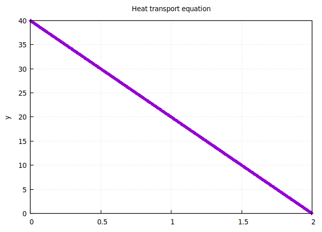
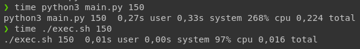

# Heat equation project using FEM

## Requirements

- gnuplot
- gfortran
- linux/mac, no windows port at the moment

## Installation

```bash
make install
```

## Executing

```bash
./exec.sh
./exec.sh n
```

,where `n` stands for amount of elements

## Cleaning

```bash
make clean
```

or just delete build folder

## Solution

So the solution looks simple:



## Why Fortran

For this task I could use probably every language except Octave and Matlab. So why Fortran you might have asked?

Well I also did it in Python3 with NumPy
And here are the times of executions.



## Problem


![x \in [0,2]](./svgs/4.svg)

### Find u(x) in [0,2]

---


---


---


## Code used

During making this project I used:

- ogpf - [Object Based Interface to GnuPlot from Fortran](https://github.com/kookma/ogpf)
- LU decomposition routines (and solver), [F90 version by J-P Moreau, Paris](http://jean-pierre.moreau.pagesperso-orange.fr/Fortran/lu_f90.txt), changed a little to suite bigger max n in LU decomposition
